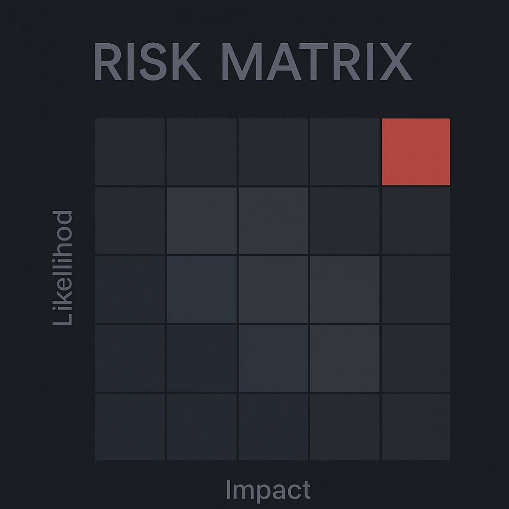

# Matriz de Risco – 5x5 (Dark Mode)

Este é um projeto simples e responsivo de **Matriz de Risco 5x5**, feito com HTML, CSS e JavaScript puro, com visual em **tema escuro**.

## 🔍 Funcionalidades

- Cadastro de riscos com:
  - Título
  - Descrição
  - Probabilidade (1 a 5)
  - Impacto (1 a 5)
- Exibição dos riscos na matriz 5x5
- Colorização automática por nível de risco
- Tooltip ao passar o mouse com a descrição completa
- Logo personalizada no topo
- Interface responsiva

## 📦 Tecnologias

- HTML5
- CSS3 (Dark Mode)
- JavaScript puro (sem frameworks)
- GitHub Pages para publicação

## 🚀 Como usar

1. Faça um fork ou clone do repositório
2. Edite localmente ou envie os arquivos diretamente
3. Acesse pela URL do GitHub Pages:
   ```
   https://pramoroso.github.io/matriz-de-risco/
   ```

## ✨ Visual



## 🧑‍💻 Autor

Desenvolvido por Paulo Amoroso como projeto pessoal de portfólio.
